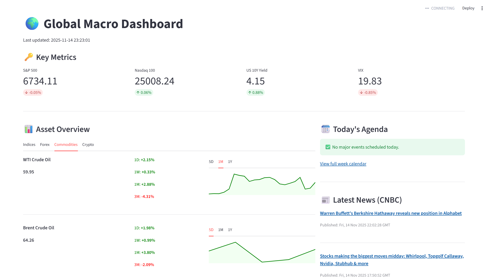

# 📈 Global Macro Dashboard (Student Project)

An interactive web application built in Python for monitoring global financial markets and key macro-economic indicators. This dashboard serves as a daily briefing tool, consolidating data from various sources into a single, easy-to-read interface.



---

## 📌 Objective

As an aspiring finance professional, this project was built to create a centralized tool for tracking the assets and indicators that matter most. It's designed to be a "mission control" for staying on top of market movements and economic data, perfect for daily briefings or interview preparation.

---

## ✨ Features

* **Key Metrics (KPIs):** A top-level view of the four most critical market drivers: S&P 500, Nasdaq 100, US 10Y Yield, and the VIX.
* **Asset Overview:** A detailed breakdown of all major asset classes with multi-period performance charts (5D, 1M, 1Y) on a logarithmic scale.
    * **Global Indices:** (US, Europe, Asia)
    * **Forex:** (Major pairs like EUR/USD, USD/JPY)
    * **Commodities:** (WTI/Brent Crude, Gold, Copper)
    * **Crypto:** (Bitcoin, Ethereum)
* **Top 10 Market Caps:** A fundamental look at the 10 largest US companies (MSFT, AAPL, etc.), including their Market Cap, P/E Ratio, and 1-Year performance.
* **Sidebar (The "Briefing"):**
    * **Today's Agenda:** A real-time economic calendar of high-impact events for the current day (Source: Forex Factory).
    * **Latest News:** The latest financial news headlines (Source: CNBC).
    * **Key Macro Indicators:** The latest official values for foundational economic data (CPI, NFP, FED/ECB Rates) via the FRED API.

---

## 🛠️ Tech Stack

* **Language:** Python
* **Dashboard Framework:** Streamlit
* **Market Data:** `yfinance`
* **Macroeconomic Data:** `fredapi` (St. Louis Federal Reserve API)
* **News/Calendar Data:** `feedparser` (RSS Feeds)
* **Visualization:** Plotly (via Streamlit)
* **Data Manipulation:** Pandas

---

## 🚀 How to Run Locally

This project is configured for secure and reproducible local execution using Python.

**Prerequisites:**
* Python 3.8 or higher installed.
* Git installed.

### 1. Clone the Repository
```bash
git clone https://github.com/Theophile13/Global-Macro-Dashboard.git
cd Global-Macro-Dashboard
```
**2. Create and Activate a Virtual Environment:**
```bash
# Create the environment
python -m venv .venv

#Allow script execution (if you get permission error)
Set-ExecutionPolicy -ExecutionPolicy RemoteSigned -Scope Process

# Activate (Windows PowerShell)
.\venv\Scripts\Activate.ps1

# Activate (macOS/Linux)
# source venv/bin/activate
```
**3. Install Dependencies:** All required libraries are listed in requirements.txt.
```bash
pip install -r requirements_macro_dash.txt
```
**4. Set Up API Keys (Secrets):** This project requires a free API key from the St. Louis FRED.

* Get your key here: https://fred.stlouisfed.org/docs/api/api_key.html
* Create a new folder in the project root named .streamlit (with the dot).
* Inside that folder, create a new file named secrets.toml.
* Add your key to this file:

```ini TOML
# .streamlit/secrets.toml
FRED_API_KEY = "your_32_character_api_key_goes_here"
```
* (Note: The .gitignore file is already configured to keep this file private and secure.)

**5. Run the Application:** Use the reliable python -m method to launch the server:
```bash
python -m streamlit run dashboard.py
```
The application will automatically open in your default web browser.

---

## ☁️ Deployment
This repository is pre-configured for deployment on [Streamlit Community Cloud](https://share.streamlit.io/). Simply link your GitHub account, select this repository, and add your FRED_API_KEY in the Streamlit Cloud secrets manager.